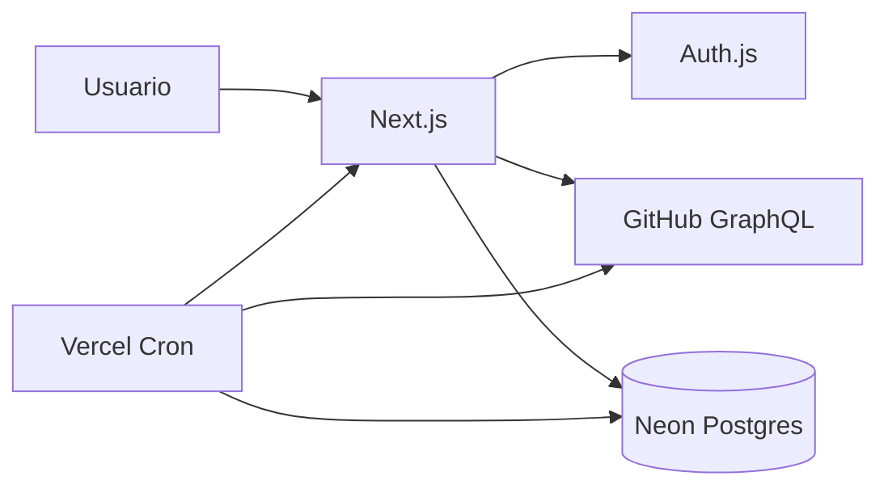
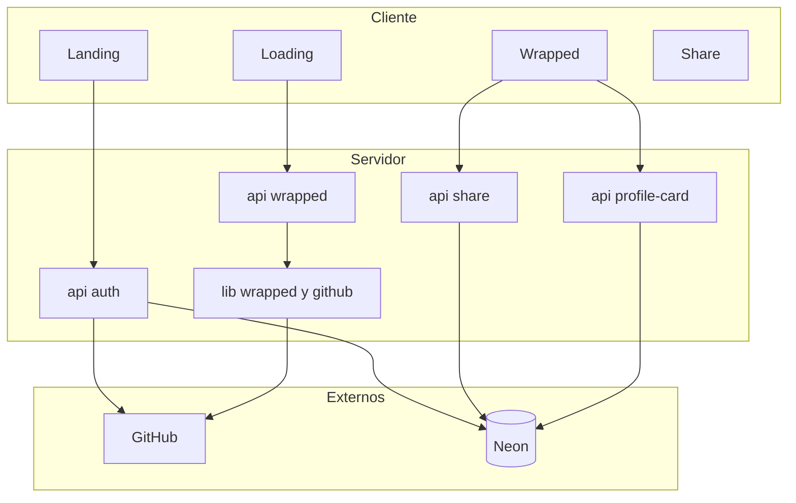
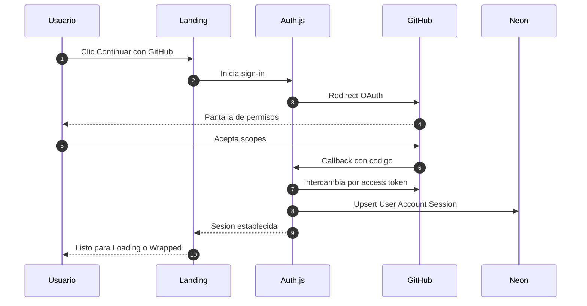
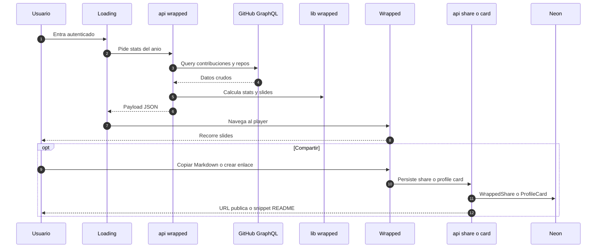
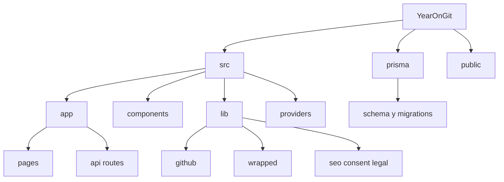
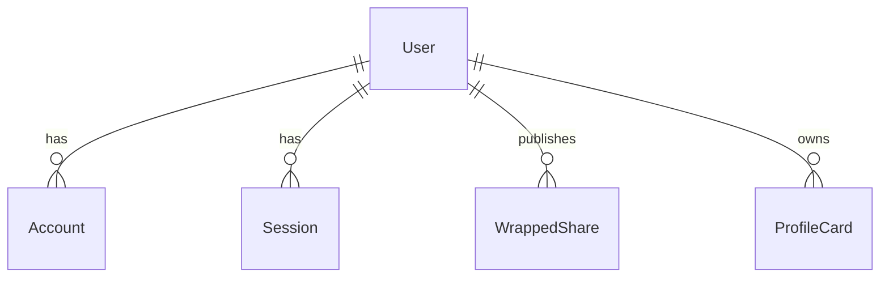
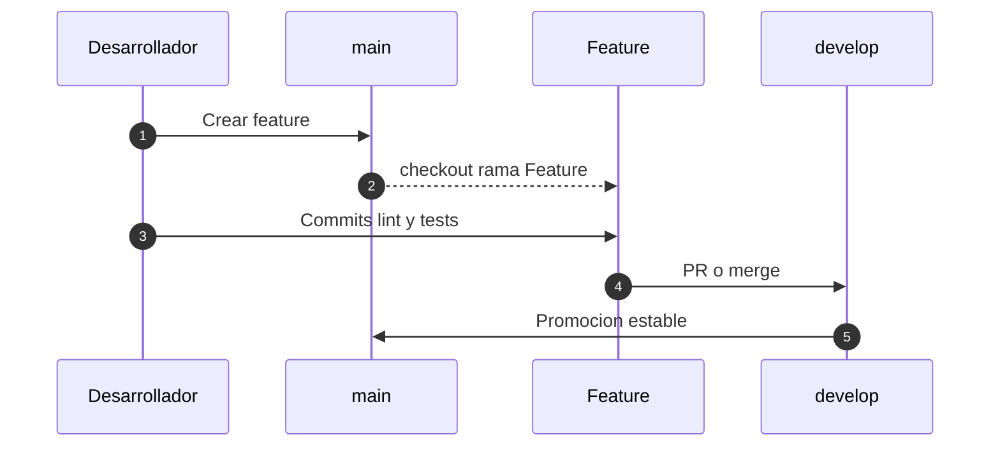
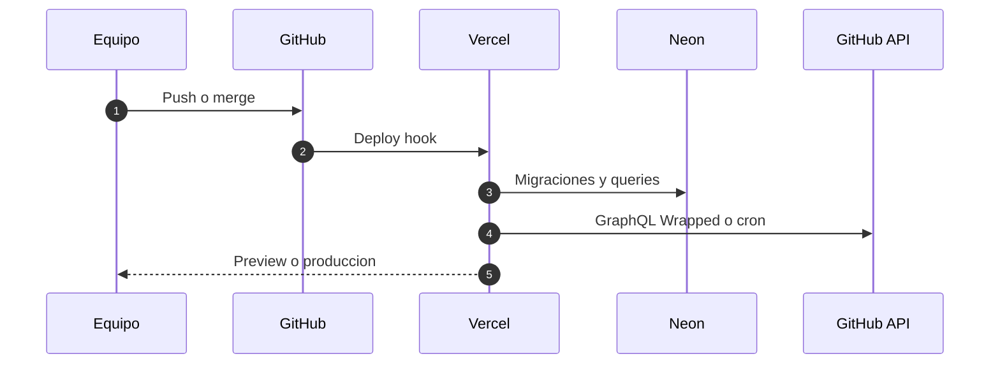

# YearOnGit

Tu año en GitHub, contado como un Wrapped: commits, lenguajes, rachas, highlights y una tarjeta que puedes pegar en el README de tu perfil.

[](https://github.com/Erickpe8/YearOnGit/commits)
[](https://github.com/Erickpe8/YearOnGit/blob/main/package.json)
[](https://github.com/Erickpe8/YearOnGit/stargazers)


> [!NOTE]
> YearOnGit es un **monolito** Next.js (App Router): la interfaz y las API routes viven en el mismo proyecto. El *access token* de GitHub (la credencial que emite OAuth) **nunca se envía al navegador**; solo se usa en el servidor.

---

## Tabla de contenidos

- [Visión general](#visión-general)
- [Quick Start](#quick-start-60-segundos)
- [Stack tecnológico](#stack-tecnológico)
- [Requisitos](#requisitos)
- [Puesta en marcha](#puesta-en-marcha)
- [Rutas](#rutas)
- [Arquitectura](#arquitectura)
- [Flujo de autenticación](#flujo-de-autenticación)
- [Flujo de generación del Wrapped](#flujo-de-generación-del-wrapped)
- [Estructura del proyecto](#estructura-del-proyecto)
- [Schema de datos](#schema-de-datos)
- [SEO, sitemap y robots](#seo-sitemap-y-robots)
- [Privacidad, términos y cookies](#privacidad-términos-y-cookies)
- [Catálogo para LLMs](#catálogo-para-llms)
- [Reglas para agentes](#reglas-para-agentes)
- [Comandos útiles](#comandos-útiles)
- [Seguridad](#seguridad)
- [FAQ de onboarding](#faq-de-onboarding)
- [Contribución y GitFlow](#contribución-y-gitflow)
- [CI/CD y despliegue (Vercel)](#cicd-y-despliegue-vercel)
- [Variables de entorno](#variables-de-entorno)
- [Estado del proyecto](#estado-del-proyecto)

---

## Visión general

YearOnGit existe para que un desarrollador vea **su propio año en GitHub** de forma narrativa, no como un dashboard de tablas. La idea es: conectas la cuenta una vez, el servidor lee actividad vía GraphQL, calcula stats del año y las presenta en slides; si quieres, generas un enlace público o Markdown para el perfil.

En la práctica el producto cubre:

1. **Login con GitHub** — OAuth (el usuario autoriza en GitHub; YearOnGit no pide ni guarda contraseñas).
2. **Wrapped del año** — slides con commits, lenguajes, rachas, highlights, etc.
3. **Compartir** — slug público (`/share/[slug]`) y/o **profile card** (imagen + Markdown para el README).
4. **Admin** — ediciones, slides, features, mantenimiento y auditoría, restringido a logins allowlisted.

> [!TIP]
> Punto de entrada al código: `src/app/page.tsx` → `src/app/api/wrapped/route.ts` → `src/lib/wrapped/`.

---

## Quick Start (60 segundos)

Con las variables mínimas ya en `.env` (ver [Puesta en marcha](#puesta-en-marcha)):

```bash
cp .env.example .env
npm install
npx prisma migrate deploy
npm run dev
```

Luego abre `http://localhost:3000`.

> [!TIP]
> Sin OAuth App ni base de datos Neon configuradas, la landing carga, pero el login y el Wrapped no funcionarán.

---

## Stack tecnológico

El stack está pensado para un producto web público con auth social y datos vivos de GitHub, desplegado en Vercel y respaldado por Postgres serverless.

### App (UI y runtime)

| Tecnología | Rol en el proyecto |
|------------|--------------------|
| **Next.js 16** (App Router) | Páginas, layouts y API routes en un solo repo |
| **React 19** + **TypeScript 5** | UI tipada |
| **Tailwind CSS v4** | Estilos (tema dark) |
| **Framer Motion** | Animaciones de landing y slides del Wrapped |

### Auth y datos

| Tecnología | Rol en el proyecto |
|------------|--------------------|
| **Auth.js** (`next-auth` v5) | Sesiones y proveedor GitHub |
| **Prisma** + **Neon Postgres** | Persistencia (usuarios, shares, cards, settings) |
| **GitHub GraphQL API** | Fuente de verdad de actividad del año (`contributionsCollection`, repos, lenguajes…) |

Scopes OAuth configurados en `src/auth.ts`: `read:user repo read:org`.  
(*Scope* = permiso que GitHub otorga a la app. La app usa esos permisos para **leer** actividad, incluidos repos privados cuando GitHub los expone al token; no hay flujos de escritura sobre repos en el producto.)

### Producto e infraestructura

- Shares (`WrappedShare`), profile cards (`ProfileCard`) y cron diario en Vercel.
- Panel `/admin` (editions, slides, features, maintenance, logs).
- Cookies + GA4 opcional; i18n multi-idioma.
- Hosting: **Vercel** (no hay Docker Compose ni orquestador propio en este repo).

---

## Requisitos

- **Node.js 20+** y **npm**
- Cuenta en **Neon** (u otro Postgres compatible con Prisma; el código usa el adapter de Neon)
- Una **GitHub OAuth App** en [GitHub Developer Settings](https://github.com/settings/developers)

> [!WARNING]
> Los puertos por defecto son los de Next (`3000`). No hay servicios locales adicionales (Redis, MinIO, etc.) en este proyecto.

---

## Puesta en marcha

El objetivo de este setup es dejar la app lista para probar el flujo completo: landing → OAuth → loading → Wrapped.

### 1) Clonar

```bash
git clone https://github.com/Erickpe8/YearOnGit.git
cd YearOnGit
```

### 2) Entorno

```bash
cp .env.example .env
```

Rellena al menos las variables marcadas como requeridas en [Variables de entorno](#variables-de-entorno).

**OAuth App (local)**

| Campo | Valor |
|-------|--------|
| Homepage URL | `http://localhost:3000` |
| Authorization callback URL | `http://localhost:3000/api/auth/callback/github` |

### 3) Instalar, migrar y correr

```bash
npm install
npx prisma migrate deploy
npm run dev
```

### 4) Accesos

| URL | Quién |
|-----|--------|
| `http://localhost:3000` | Cualquiera |
| `http://localhost:3000/admin` | Solo logins en allowlist (`Erickpe8` por defecto + `ADMIN_GITHUB_LOGINS`) |

---

## Rutas

Las **páginas** son rutas del App Router. Las **API** son *route handlers* en `src/app/api/**` (código de servidor que responde JSON u otros formatos).

### Páginas

| Método | Ruta | Descripción | Auth |
|--------|------|-------------|------|
| GET | `/` | Landing / welcome | No |
| GET | `/how-it-works` | Cómo funciona YearOnGit | No |
| GET | `/faq` | Preguntas frecuentes + enlace a Discussions | No |
| GET | `/privacy` | Política de privacidad | No |
| GET | `/terms` | Términos de uso | No |
| GET | `/share/[slug]` | Wrapped público compartido | No |
| GET | `/cards/[username]/[year]` | Imagen de profile card | No |
| GET | `/loading` | Pantalla de armado del Wrapped | Sí (sesión) |
| GET | `/wrapped` | Player de slides | Sí (sesión) |
| GET | `/admin` | Panel operativo | Sí + admin |
| GET | `/auth/popup-done` | Cierre del popup OAuth | Flujo auth |

Redirects permanentes: `/privacidad` → `/privacy`, `/terminos` → `/terms`.

### API principales

| Método | Ruta | Descripción | Auth |
|--------|------|-------------|------|
| * | `/api/auth/[...nextauth]` | Auth.js (login, callback, sesión) | Flujo OAuth |
| GET | `/api/wrapped` | Stats del año para el usuario autenticado | Sí |
| POST | `/api/share` | Crea / actualiza un share público | Sí |
| POST | `/api/profile-card` | Genera / actualiza profile card | Sí |
| GET | `/api/live` | Estado “live” del producto (features / edición) | No |
| GET | `/api/cron/refresh-profile-cards` | Refresh programado de cards | Bearer `CRON_SECRET` |
| GET/PATCH | `/api/admin/*` | Settings, slides, editions, users, health… | Sí + admin |

---

## Arquitectura

YearOnGit no separa frontend y backend en servicios distintos: el navegador habla con Next.js; Next.js habla con GitHub y con Neon. Eso reduce latencia de integración y mantiene el token fuera del cliente.

**Flujo de datos (en prosa):** el usuario autoriza en GitHub → Auth.js guarda sesión y cuenta en Postgres → al pedir el Wrapped, el servidor usa el token para consultar GraphQL → `src/lib/wrapped` calcula slides/stats → la UI renderiza `/wrapped` → si comparte, se persiste un snapshot (`WrappedShare`) y/o una card (`ProfileCard`).

### Diagrama de arquitectura (alto nivel)



### Diagrama de capas cliente / servidor



---

## Flujo de autenticación

El login no inventa usuarios a mano: GitHub es el identity provider. Tras el consent del usuario, Auth.js crea o actualiza `User` / `Account` / `Session` en la base.

### Diagrama de flujo de autenticación



Detalles útiles:

- Scopes reales: `read:user repo read:org` (definidos en `src/auth.ts`).
- La contraseña de GitHub **no** pasa por YearOnGit.
- El logout invalida la sesión de Auth.js en el servidor.

---

## Flujo de generación del Wrapped

Una vez autenticado, el Wrapped no se “adivina”: se **construye** en el servidor a partir de la API de GitHub y luego se proyecta en slides. Compartir es opcional y crea un snapshot público (sin token).

### Diagrama de flujo del Wrapped



---

## Estructura del proyecto

La organización sigue el App Router de Next: rutas en `app/`, UI en `components/`, dominio en `lib/`. No hay carpeta `Modules/` tipo Laravel; el “módulo” Wrapped está en `src/lib/wrapped` + componentes `src/components/wrapped`.

### Diagrama de carpetas



```text
src/
  app/            # Rutas UI + API + sitemap/robots
  components/     # Landing, wrapped, legal, admin, seo…
  lib/            # GitHub client, wrapped, auth helpers, errors…
  providers/      # App, consent, toasts, sfx…
prisma/           # Schema y migraciones
public/           # Assets estáticos + llms.txt
```

---

## Schema de datos

Postgres es la memoria de largo plazo: sesiones, snapshots compartibles y configuración admin. Las métricas “en vivo” del Wrapped salen de GitHub en el momento del fetch (salvo shares/cards ya materializados).

| Modelo | Para qué sirve |
|--------|----------------|
| `User` / `Account` / `Session` | Identidad y sesión Auth.js |
| `VerificationToken` | Flujo estándar Auth.js |
| `WrappedShare` | Snapshot público por usuario/año (`slug` + `stats` JSON) |
| `ProfileCard` | Stats year-scoped para imagen README; refresh acotado mientras el año corre |
| `AppSettings` | Mantenimiento, sign-ins, config JSON (slides/features/editions) |
| `AdminAuditLog` | Quién cambió qué en admin |



> [!WARNING]
> En shares y cards solo van métricas públicas serializadas. El `access_token` vive en `Account` en el servidor y no se expone al cliente.

---

## SEO, sitemap y robots

El SEO del producto no depende de un CMS: cada superficie pública tiene metadata propia (`src/lib/seo/pages.ts`), y Next genera `/sitemap.xml` y `/robots.txt` en build/runtime.

**En código**

- Titles/descriptions + Open Graph / Twitter por página
- JSON-LD `WebApplication` en `/` y `FAQPage` en `/faq`
- GA4 solo si el usuario aceptó analítica en cookies

**Sitemap incluye:** `/`, `/how-it-works`, `/faq`, `/privacy`, `/terms`

**Robots allow:** esas rutas + `/share/`  
**Robots disallow:** `/admin`, `/api/`, `/wrapped`, `/loading`, `/auth/`, `/errors/`

**Manual en producción**

1. Propiedad en Google Search Console  
2. Enviar `https://<dominio>/sitemap.xml`  
3. Verificar con `NEXT_PUBLIC_GSC_VERIFICATION` o DNS  
4. Measurement ID de GA4 en `NEXT_PUBLIC_GA_MEASUREMENT_ID`

---

## Privacidad, términos y cookies

La capa legal y de consentimiento existe para ser explícitos: qué se lee de GitHub, qué se guarda, y qué analítica es opcional.

- Páginas: `/privacy` y `/terms` (contenido EN/ES en `src/lib/legal/content.ts`)
- Banner de cookies: esenciales siempre; analítica (GA4) y preferencias opcionales
- Persistencia de elección: `localStorage` → clave `yearongit-cookie-consent` (versionada, ~12 meses)
- Reabrir preferencias: footer → **Ajustes de cookies**

---

## Catálogo para LLMs

Resumen estable para agentes/LLMs que indexan el producto:

YearOnGit es un producto web gratuito que convierte el año de un desarrollador en GitHub en un Wrapped cinematográfico (contribuciones, lenguajes, rachas, highlights, tarjetas). Auth: GitHub OAuth de solo uso de lectura en la app. Páginas primarias: `/`, `/how-it-works`, `/faq`, `/privacy`, `/terms`, `/share/{slug}`. Privadas: `/wrapped`, `/loading`, `/admin`, `/api/*`. Sitemap `/sitemap.xml`, robots `/robots.txt`.

---

## Reglas para agentes

Si un asistente de código trabaja en este repo, debe respetar estas convenciones (además del estilo del código existente):

1. **Tokens OAuth solo en servidor** — no loguearlos ni mandarlos al cliente.  
2. **Preferir GraphQL agrupado** (`contributionsCollection`) frente a muchas llamadas REST.  
3. **UI dark / slides cinematográficas** — no rediseñar a un look genérico de dashboard.  
4. **Idioma:** responder en español cuando el usuario escriba en español.  
5. Endpoints centrales: `/api/auth/*`, `/api/wrapped`.

---

## Comandos útiles

```bash
# Desarrollo
npm run dev
npm run lint
npm run typecheck

# Base de datos
npm run db:generate
npm run db:migrate
npm run db:push
npm run db:studio

# Pruebas (Node test runner vía tsx)
npm test

# Producción local
npm run build
npm run start
```

> [!NOTE]
> `npm run build` = `prisma generate` + `prisma migrate deploy` + `next build`.

---

## Seguridad

La superficie sensible es el token de GitHub y los datos de sesión. El diseño asume: “el navegador ve UI y JSON público; el servidor habla con GitHub”.

- OAuth con scopes de lectura de actividad; sin contraseñas propias.
- Tokens y secretos solo en entorno servidor / Vercel.
- Cron de profile cards exige `Authorization: Bearer ${CRON_SECRET}`.
- Admin por allowlist de `login` de GitHub (`ADMIN_GITHUB_LOGINS`).
- GA4 no carga hasta consentimiento de analítica.

---

## FAQ de onboarding

### ¿Por dónde empiezo a leer código?
Landing → `src/lib/github` → `src/lib/wrapped` → `src/app/api/wrapped`.

### ¿Por qué falla el login en local?
Callback URL distinto al de la OAuth App, `AUTH_URL` incorrecto, o falta `AUTH_SECRET`.

### ¿Qué corro antes de un PR?
```bash
npm run lint
npm run typecheck
npm test
```

### ¿Cómo reabro cookies?
Footer → **Ajustes de cookies**.

### ¿Dónde pregunto dudas de producto?
GitHub Discussions del repo, categoría Q&A / Preguntas.

---

## Contribución y GitFlow

Se espera trabajo en ramas pequeñas, con lint/typecheck/tests antes del PR.

**Ramas**

- `main` — estable / producción  
- `develop` — integración  
- `Feature/tkN-descripcion` — requerimiento  

Ejemplos: `Feature/tk10-seo-audit`, `hotfix/fix-oauth-callback`, `release/2026-wrapped`.



---

## CI/CD y despliegue (Vercel)

Este repositorio está orientado a **Vercel** (hay `vercel.json` con un cron diario). No hay workflow de GitHub Actions ni CapRover en el árbol actual del proyecto: el deploy típico es el de la integración Git → Vercel.

1. Push / merge a la rama conectada en Vercel.  
2. Build con Prisma + Next.  
3. Env vars solo en el dashboard de Vercel.  
4. Cron `0 6 * * *` → `GET /api/cron/refresh-profile-cards`.



> [!WARNING]
> No hay badge de “build passing” de Actions porque este repo no define workflows CI en `.github/workflows` en el estado actual. Los badges dinámicos del encabezado usan shields.io sobre GitHub (último commit, versión de `package.json`, stars).

---

## Variables de entorno

Copia desde `.env.example`. Los valores de ejemplo son orientativos; en producción usa secretos reales solo en Vercel/Neon.

| Variable | Descripción | Ejemplo | Requerida |
|----------|-------------|---------|-----------|
| `DATABASE_URL` | Postgres pooled (Neon) | `postgresql://…` | Sí |
| `DIRECT_URL` | Postgres directo (migraciones) | `postgresql://…` | Sí |
| `AUTH_SECRET` | Secreto de sesión Auth.js | `npx auth secret` | Sí |
| `AUTH_GITHUB_ID` | Client ID OAuth App | `Ov23…` | Sí |
| `AUTH_GITHUB_SECRET` | Client Secret OAuth App | `…` | Sí |
| `AUTH_URL` | URL canónica de la app para Auth.js | `http://localhost:3000` | Sí |
| `NEXT_PUBLIC_APP_URL` | URL pública (share, sitemap, robots) | `https://yearongit.com` | Recomendada en prod |
| `NEXT_PUBLIC_GA_MEASUREMENT_ID` | ID de GA4 | `G-XXXXXXXX` | No |
| `NEXT_PUBLIC_GSC_VERIFICATION` | Token meta de Search Console | `google…` | No |
| `CRON_SECRET` | Bearer del cron de profile cards | string largo | Sí en prod con cron |
| `ADMIN_GITHUB_LOGINS` | Logins admin extra (CSV) | `alice,bob` | No |

```env
DATABASE_URL=
DIRECT_URL=
AUTH_SECRET=
AUTH_GITHUB_ID=
AUTH_GITHUB_SECRET=
AUTH_URL=http://localhost:3000
# NEXT_PUBLIC_APP_URL=https://yearongit.com
# NEXT_PUBLIC_GA_MEASUREMENT_ID=G-XXXXXXXXXX
# NEXT_PUBLIC_GSC_VERIFICATION=
# CRON_SECRET=
# ADMIN_GITHUB_LOGINS=
```

> [!WARNING]
> Nunca subas `.env` / `.env.local` con secretos reales al repositorio.

---

## Estado del proyecto

Producto en evolución activa alrededor del Wrapped 2026: experiencia de slides, shares, profile cards, admin de ediciones, SEO y consentimiento de cookies.

Versión declarada en `package.json`: **0.1.0** (también reflejada por el badge dinámico del encabezado).

> [!IMPORTANT]
> Regla de oro: el token de GitHub no sale del servidor; GraphQL agrupado antes que ráfagas REST; UI dark y narrativo, no dashboard genérico.
