# YearOnGit

Tu año en GitHub, contado como un Wrapped: commits, lenguajes, rachas, highlights y una tarjeta que puedes pegar en el README de tu perfil.

[](https://github.com/Erickpe8/YearOnGit/commits)
[](https://github.com/Erickpe8/YearOnGit/blob/main/package.json)
[](https://github.com/Erickpe8/YearOnGit/stargazers)


> [!NOTE]
> YearOnGit es un **monolito** Next.js (App Router): la interfaz y los *Route Handlers* (endpoints de servidor en `src/app/api`) viven en el mismo proyecto. El *access token* de GitHub (credencial que emite OAuth) **permanece en el servidor** y no se envía al navegador.

---

## Tabla de contenidos

- [Visión general](#visión-general)
- [¿Cómo funciona?](#cómo-funciona)
- [Características](#características)
- [Quick Start](#quick-start-60-segundos)
- [Stack tecnológico](#stack-tecnológico)
- [Decisiones técnicas](#decisiones-técnicas)
- [Requisitos](#requisitos)
- [Puesta en marcha](#puesta-en-marcha)
- [Rutas](#rutas)
- [Arquitectura](#arquitectura)
- [Flujo de autenticación](#flujo-de-autenticación)
- [Flujo de generación del Wrapped](#flujo-de-generación-del-wrapped)
- [Datos utilizados](#datos-utilizados)
- [Estructura del proyecto](#estructura-del-proyecto)
- [Schema de datos](#schema-de-datos)
- [SEO, sitemap y robots](#seo-sitemap-y-robots)
- [Privacidad, términos y cookies](#privacidad-términos-y-cookies)
- [Catálogo para LLMs](#catálogo-para-llms)
- [Reglas para agentes](#reglas-para-agentes)
- [Comandos útiles](#comandos-útiles)
- [Seguridad](#seguridad)
- [FAQ](#faq)
- [Contribución y GitFlow](#contribución-y-gitflow)
- [CI/CD y despliegue (Vercel)](#cicd-y-despliegue-vercel)
- [Variables de entorno](#variables-de-entorno)
- [Estado del proyecto](#estado-del-proyecto)

---

## Visión general

YearOnGit existe para que un desarrollador vea **su propio año en GitHub** de forma narrativa, no como un panel de tablas. En lugar de exportar CSV o mirar el contribution graph a secas, la app construye una secuencia de slides a partir de actividad real leída vía GraphQL.

El recorrido típico es: conectar GitHub una vez, dejar que el servidor calcule estadísticas del año, recorrer el Wrapped y, si quieres, publicar un enlace (`/share/[slug]`) o copiar Markdown para una *profile card* en el README del perfil.

> [!TIP]
> Punto de entrada al código: `src/app/page.tsx` → `src/app/api/wrapped/route.ts` → `src/lib/wrapped/`.

---

## ¿Cómo funciona?

YearOnGit no inventa métricas: autentica al usuario, lee su actividad en GitHub desde el servidor y transforma esa respuesta en un objeto de estadísticas (`WrappedStats`) que alimenta las slides. Compartir es un paso opcional que materializa un snapshot público sin exponer credenciales.

En prosa, el flujo completo es:

1. El usuario pulsa **Continuar con GitHub** en la landing.
2. GitHub OAuth autoriza la app; Auth.js crea la sesión en Postgres.
3. En `/loading`, el cliente pide `GET /api/wrapped`.
4. El servidor usa el access token guardado en cuenta OAuth para consultar GitHub GraphQL.
5. `src/lib/wrapped` normaliza y calcula stats (commits, lenguajes, rachas, highlights…).
6. El usuario entra a `/wrapped` y recorre las slides.
7. Desde el resumen puede crear un share público y/o generar Markdown de profile card.

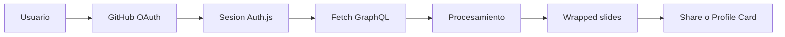

---

## Características

Estas capacidades están implementadas en el producto (UI + APIs + librerías de dominio). No son un wishlist: corresponden a slides planificadas en `plan-slides`, endpoints y modelos Prisma existentes.

| Característica | Qué ofrece |
|----------------|------------|
| **GitHub OAuth** | Login sin contraseña propia; scopes en `src/auth.ts`: `read:user repo read:org` |
| **Wrapped anual** | Experiencia de slides en `/wrapped` a partir de stats del año |
| **Tipos de contribución** | Commits, PRs, issues y code reviews agregados desde `contributionsCollection` |
| **Heatmap / calendario** | Días activos derivados del contribution calendar de GitHub |
| **Lenguajes** | Distribución a partir de lenguajes de repos con actividad |
| **Rachas** | `longestStreak` / `currentStreak` y fechas asociadas en `WrappedStats` |
| **Highlights y logros** | Slides de highlight y achievements generados desde los stats |
| **Comunidad** | Seguidores, following, estrellas/orgs cuando hay datos suficientes |
| **Shares públicos** | Snapshot en `WrappedShare` y URL `/share/[slug]` vía `POST /api/share` |
| **Profile Card** | Imagen year-scoped + Markdown README (`POST /api/profile-card`, ruta `/cards/...`) |
| **i18n** | Locales en `src/lib/i18n/locales` (en, es, fr, de, pt, it, ja, ko, zh, ar) |
| **Motion** | Animaciones con Framer Motion en landing y slides |
| **Cookies / GA4 opcional** | Banner de consentimiento; GA4 solo si se acepta analítica |

---

## Quick Start (60 segundos)

Si ya tienes Neon y una OAuth App, este bloque deja el entorno listo para probar landing → login → Wrapped.

```bash
cp .env.example .env
npm install
npx prisma migrate deploy
npm run dev
```

Abre `http://localhost:3000`. Detalle de variables: [Variables de entorno](#variables-de-entorno).

> [!TIP]
> Sin OAuth ni base de datos, la landing puede cargar, pero el login y `/api/wrapped` no completarán el flujo.

---

## Stack tecnológico

El stack concentra UI, auth y APIs en Next.js, con GitHub como fuente de actividad y Neon como memoria de sesiones y snapshots compartibles.

### App (UI y runtime)

| Tecnología | Rol en el proyecto |
|------------|--------------------|
| **Next.js 16** (App Router) | Páginas, layouts y Route Handlers en un solo repo |
| **React 19** + **TypeScript 5** | UI tipada |
| **Tailwind CSS v4** | Estilos (tema dark) |
| **Framer Motion** | Animaciones de landing y slides |

### Auth y datos

| Tecnología | Rol en el proyecto |
|------------|--------------------|
| **Auth.js** (`next-auth` v5) | Sesiones y proveedor GitHub |
| **Prisma** + **Neon Postgres** | Persistencia (usuarios, shares, cards, configuración de producto) |
| **GitHub GraphQL API** | Actividad del año (`contributionsCollection`, repos, lenguajes, orgs…) |

*Scope* = permiso que GitHub otorga a la app. La configuración actual pide `read:user repo read:org`. El producto consulta datos con GraphQL; **no implementa flujos de escritura** sobre repositorios (crear issues, push, borrar, etc.).

### Producto e infraestructura

- Shares (`WrappedShare`) y profile cards (`ProfileCard`), con cron diario en Vercel.
- Cookies + GA4 opcional; i18n multi-idioma.
- Hosting: **Vercel** (este repo no incluye Docker Compose ni orquestador propio).

---

## Decisiones técnicas

Estas decisiones se deducen de cómo está organizado el código, no de un documento de arquitectura externo.

| Decisión | Por qué encaja en este repo |
|----------|------------------------------|
| **Next.js App Router** | Une páginas (`src/app/**/page.tsx`) y APIs (`src/app/api/**/route.ts`) sin un backend separado |
| **GitHub como identidad** | Auth.js + proveedor GitHub evita cuentas/contraseñas propias |
| **GraphQL como fuente de actividad** | Una query de año (`WRAPPED_YEAR_QUERY` y relacionadas) concentra contribuciones y repos |
| **Prisma + Postgres (Neon)** | Persiste sesión OAuth, shares y cards; no sustituye a GitHub como origen de métricas en vivo |
| **`lib/wrapped` separado de la UI** | Calcula `WrappedStats` y plan de slides independiente de React; la UI solo renderiza |
| **Token solo en servidor** | El access token vive en `Account` (Prisma); las llamadas a GitHub salen de Route Handlers |

---

## Requisitos

Para desarrollar o desplegar necesitas herramientas alineadas con el stack real:

- **Node.js 20+** y **npm**
- Cuenta en **Neon** (u otro Postgres compatible; el cliente usa el adapter de Neon)
- Una **GitHub OAuth App** en GitHub Developer Settings

> [!WARNING]
> El puerto local por defecto es el de Next (`3000`). No hay Redis, colas ni MinIO en este proyecto.

---

## Puesta en marcha

El objetivo es poder recorrer el flujo completo en local: landing → OAuth → loading → Wrapped → share/card opcional.

### 1) Clonar

```bash
git clone https://github.com/Erickpe8/YearOnGit.git
cd YearOnGit
```

### 2) Entorno

```bash
cp .env.example .env
```

Completa las variables marcadas como requeridas más abajo.

**OAuth App (local)**

| Campo | Valor |
|-------|--------|
| Homepage URL | `http://localhost:3000` |
| Authorization callback URL | `http://localhost:3000/api/auth/callback/github` |

### 3) Instalar, migrar y correr

```bash
npm install
npx prisma migrate deploy
npm run dev
```

### 4) Acceso

| URL | Uso |
|-----|-----|
| `http://localhost:3000` | Landing y flujo de usuario |

---

## Rutas

Las **páginas** son rutas del App Router. Las **API** son Route Handlers en `src/app/api/**` que responden JSON (u otros formatos) y pueden usar el token de GitHub o Prisma con seguridad.

### Páginas

| Método | Ruta | Descripción | Auth |
|--------|------|-------------|------|
| GET | `/` | Landing / welcome | No |
| GET | `/how-it-works` | Cómo funciona YearOnGit | No |
| GET | `/faq` | Preguntas frecuentes | No |
| GET | `/privacy` | Política de privacidad | No |
| GET | `/terms` | Términos de uso | No |
| GET | `/share/[slug]` | Wrapped público compartido | No |
| GET | `/cards/[username]/[year]` | Imagen de profile card | No |
| GET | `/loading` | Armado del Wrapped | Sí (sesión) |
| GET | `/wrapped` | Player de slides | Sí (sesión) |
| GET | `/auth/popup-done` | Cierre del popup OAuth | Flujo auth |

Redirects: `/privacidad` → `/privacy`, `/terminos` → `/terms`.

### API principales

| Método | Ruta | Descripción | Auth |
|--------|------|-------------|------|
| * | `/api/auth/[...nextauth]` | Auth.js (login, callback, sesión) | Flujo OAuth |
| GET | `/api/wrapped` | Stats del año del usuario autenticado | Sí |
| POST | `/api/share` | Crea / actualiza share público | Sí |
| POST | `/api/profile-card` | Genera / actualiza profile card | Sí |
| GET | `/api/live` | Estado público del producto | No |
| GET | `/api/cron/refresh-profile-cards` | Refresh de cards obsoletas | Bearer `CRON_SECRET` |

---

## Arquitectura

YearOnGit no separa frontend y backend en servicios distintos: el navegador habla con Next.js; Next.js habla con GitHub y con Neon. Así el access token nunca necesita residir en el cliente.

**Flujo de datos:** OAuth → sesión en Postgres → `GET /api/wrapped` → GraphQL → `lib/wrapped` → slides → opcionalmente `WrappedShare` / `ProfileCard`.

### Diagrama de arquitectura (alto nivel)

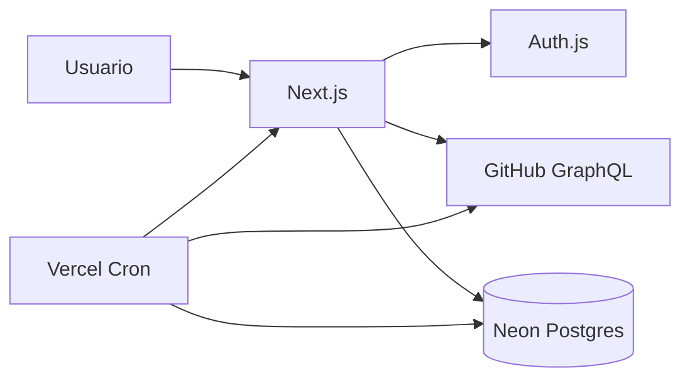

### Diagrama de capas cliente / servidor

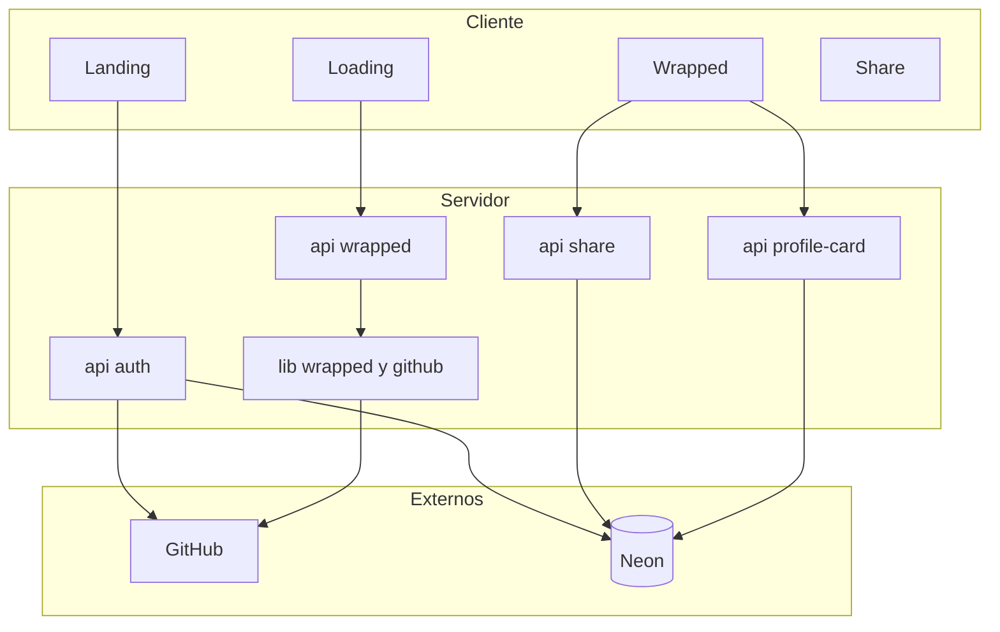

### De GitHub a WrappedStats

Este diagrama detalla la transformación de datos crudos en el objeto que consumen las slides.

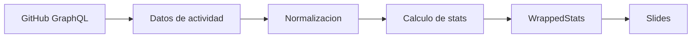

### Seguridad del access token

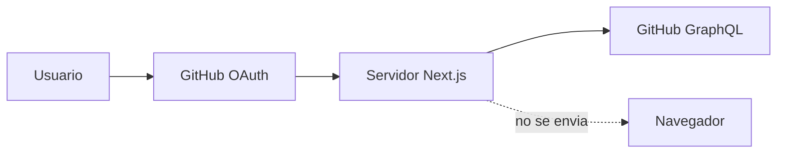

El token queda asociado a la cuenta OAuth en base de datos y solo lo usan Route Handlers / jobs de servidor.

### Actualización de Profile Cards (cron)

Confirmado en `vercel.json`: cron diario `0 6 * * *` hacia `/api/cron/refresh-profile-cards`. El handler exige `Authorization: Bearer ${CRON_SECRET}`, lista cards “stale” y llama a `refreshProfileCard`.

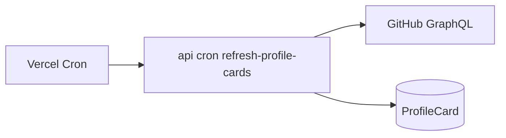

### Flujo para desarrolladores (código)

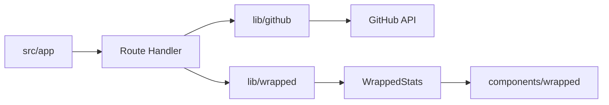

---

## Flujo de autenticación

GitHub actúa como proveedor de identidad: YearOnGit no gestiona contraseñas. Tras el consentimiento, Auth.js persiste `User`, `Account` y `Session` en Postgres.

### Diagrama de flujo de autenticación

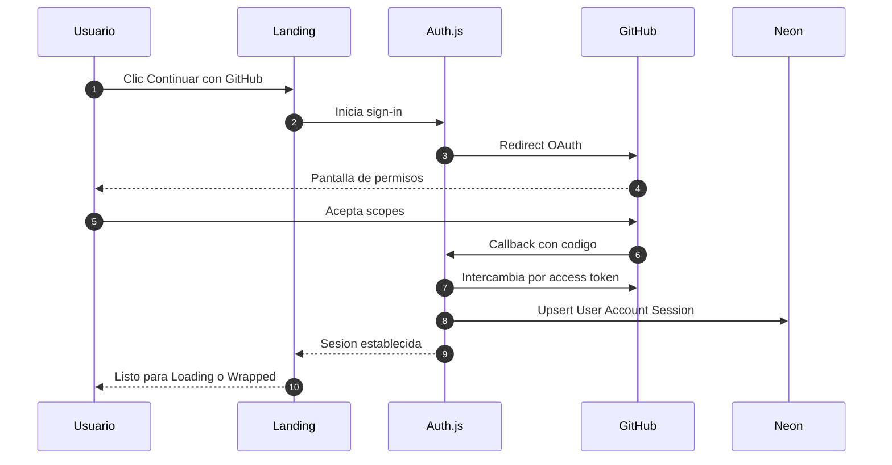

- Scopes: `read:user repo read:org` (`src/auth.ts`).
- La contraseña de GitHub no pasa por YearOnGit.
- Logout invalida la sesión Auth.js en el servidor.

---

## Flujo de generación del Wrapped

El Wrapped se **construye** en el servidor a partir de GraphQL y se proyecta en slides. Compartir y la profile card son pasos opcionales con diagramas propios más abajo.

### Diagrama de flujo del Wrapped

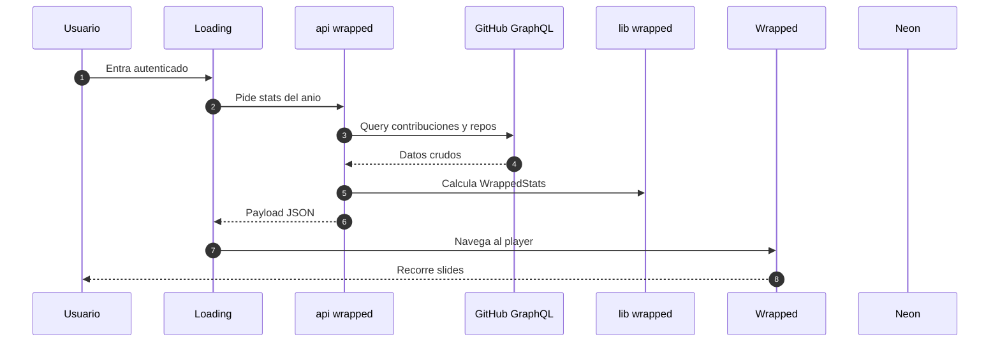

### Flujo de share público

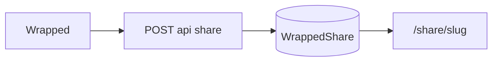

### Flujo de Profile Card

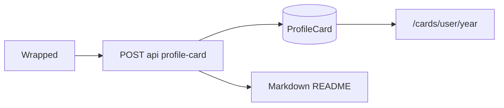

---

## Datos utilizados

La query principal (`WRAPPED_YEAR_QUERY` y consultas relacionadas en `src/lib/github/queries.ts`) pide a GitHub, entre otros, perfil, calendario de contribuciones, repos con actividad, lenguajes, gists, stars y organizaciones. Esos campos se agregan en `WrappedStats` para las slides.

### Qué se lee de GitHub (resumen)

| Dato (origen GraphQL) | Uso en el Wrapped |
|-----------------------|-------------------|
| Perfil (`login`, `name`, `avatarUrl`, bio, company, location…) | Identidad en slides / payload |
| Followers / following | Módulo comunidad / social |
| Contribution calendar (días y counts) | Heatmap, rachas, días activos |
| Commits / PRs / issues / reviews (totales y por repo) | Tipos de contribución y repos top |
| Restricted contributions | Flags de actividad restringida |
| Lenguajes por repositorio | Slide de lenguajes |
| Repos owned (públicos/privados, forks, archived, starred) | Breakdown de repositorios y popularidad |
| Organizations | Conteo / contexto de comunidad |
| Pinned repositories | Contexto de perfil |

### Qué se persiste vs qué se vuelve a pedir

| En Neon (Prisma) | Directo de GitHub en el momento del fetch |
|------------------|-------------------------------------------|
| Usuario, cuenta OAuth (incluye access token en servidor), sesión | Contribuciones y métricas “en vivo” al llamar `/api/wrapped` o al refrescar una card |
| `WrappedShare.stats` (snapshot JSON público) | — |
| `ProfileCard.stats` + `refreshedAt` | Refresh periódico vía cron vuelve a consultar GitHub |
| `AppSettings` (configuración de producto) | — |

---

## Estructura del proyecto

Next App Router organiza rutas en `app/`, UI en `components/` y dominio en `lib/`. El “motor” del Wrapped no vive en componentes: vive en `src/lib/wrapped` y se alimenta de `src/lib/github`.

### Diagrama de carpetas

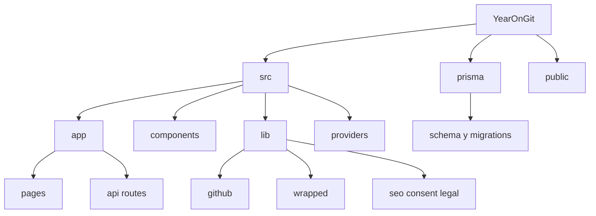

```text
src/
  app/            # Rutas UI + API + sitemap/robots
  components/     # Landing, wrapped, legal, seo…
  lib/            # GitHub client, wrapped, auth, project-index…
  providers/      # App, consent, toasts, sfx…
prisma/           # Schema y migraciones
public/           # Assets estáticos + llms.txt
.project/         # Project Intelligence Index (mapa para agentes; ver .project/README.md)
```

---

## Schema de datos

Postgres guarda identidad/sesión y materializaciones públicas (shares y cards). No reemplaza a GitHub como origen de la actividad del año en el momento de generar un Wrapped fresco.

| Modelo | Para qué sirve |
|--------|----------------|
| `User` / `Account` / `Session` | Identidad y sesión Auth.js |
| `VerificationToken` | Flujo estándar Auth.js |
| `WrappedShare` | Snapshot público por usuario/año (`slug` + `stats` JSON) |
| `ProfileCard` | Stats year-scoped para imagen README; refresh acotado mientras el año corre |
| `AppSettings` | Configuración de producto persistida |

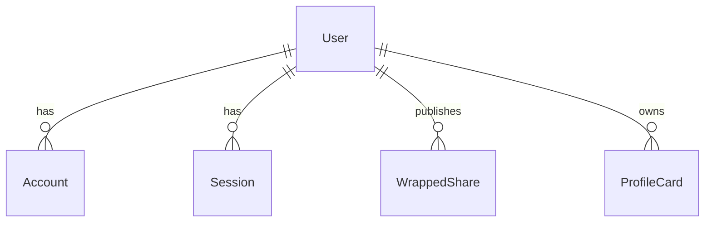

> [!WARNING]
> Shares y cards almacenan métricas públicas serializadas. El `access_token` de GitHub está en `Account` en el servidor y no se expone al cliente.

---

## SEO, sitemap y robots

Cada superficie pública tiene metadata propia (`src/lib/seo/pages.ts`). Next genera `/sitemap.xml` y `/robots.txt` desde `src/app/sitemap.ts` y `src/app/robots.ts`.

**En código**

- Titles/descriptions + Open Graph / Twitter
- JSON-LD `WebApplication` en `/` y `FAQPage` en `/faq`
- GA4 solo tras consentimiento de analítica

**Sitemap:** `/`, `/how-it-works`, `/faq`, `/privacy`, `/terms`  

**Robots allow:** esas rutas + `/share/`  
**Robots disallow:** `/api/`, `/wrapped`, `/loading`, `/auth/`, `/errors/`

**Manual en producción:** Search Console + envío de sitemap; opcionalmente `NEXT_PUBLIC_GSC_VERIFICATION` y GA4.

---

## Privacidad, términos y cookies

Las páginas legales y el banner de cookies existen para dejar claro qué se lee de GitHub, qué se guarda y qué analítica es opcional.

- `/privacy` y `/terms` (textos EN/ES en `src/lib/legal/content.ts`)
- Banner: esenciales siempre; analítica (GA4) y preferencias opcionales
- Elección en `localStorage` (`yearongit-cookie-consent`, ~12 meses)
- Reabrir: footer → **Ajustes de cookies**

---

## Catálogo para LLMs

YearOnGit es un producto web gratuito que convierte el año de un desarrollador en GitHub en un Wrapped cinematográfico (contribuciones, lenguajes, rachas, highlights, tarjetas). Auth: GitHub OAuth. Páginas primarias: `/`, `/how-it-works`, `/faq`, `/privacy`, `/terms`, `/share/{slug}`. Privadas: `/wrapped`, `/loading`, `/api/*`. Sitemap `/sitemap.xml`, robots `/robots.txt`.

---

## Reglas para agentes

Convenciones al modificar este repo:

1. Tokens OAuth **solo en servidor**.  
2. Preferir GraphQL agrupado (`contributionsCollection`) frente a muchas llamadas REST.  
3. UI dark / slides cinematográficas.  
4. Responder en español si el usuario escribe en español.  
5. Endpoints centrales de producto: `/api/auth/*`, `/api/wrapped`.  
6. Antes de explorar a ciegas: `npm run project:query -- relevant --q="…"` (índice en `.project/`).

---

## Comandos útiles

```bash
# Desarrollo
npm run dev
npm run lint
npm run typecheck

# Project Intelligence Index
npm run project:query -- relevant --q="wrapped"
npm run project:index -- --full
npm run index

# Base de datos
npm run db:generate
npm run db:migrate
npm run db:push
npm run db:studio

# Pruebas (Node test runner vía tsx)
npm test

# Producción local
npm run build
npm run start
```

> [!NOTE]
> `npm run build` = `prisma generate` + `prisma migrate deploy` + `next build`.

---

## Seguridad

La superficie sensible es el access token de GitHub y la sesión. El diseño del monolito asume: el navegador recibe UI y JSON de producto; el servidor es quien habla con GitHub.

- **Autenticación:** GitHub OAuth vía Auth.js; no hay contraseñas de YearOnGit.
- **Access token:** se obtiene en el callback OAuth, se asocia a `Account` y se usa en servidor para GraphQL.
- **Cliente:** no recibe el token; recibe stats / payloads de producto.
- **Shares y cards:** contienen métricas públicas serializadas (`stats` JSON), no tokens ni secretos.
- **Cron de cards:** requiere `Authorization: Bearer ${CRON_SECRET}`.
- **GA4:** solo si el usuario aceptó la categoría de analítica.

---

## FAQ

### ¿Por qué necesito iniciar sesión con GitHub?
Porque las estadísticas salen de tu actividad en GitHub. OAuth identifica al usuario y permite al servidor leer esos datos con un token propio de la app.

### ¿YearOnGit puede modificar mis repositorios?
El código de producto **no implementa** operaciones de escritura sobre repos (push, borrar, abrir PRs, etc.). Consulta actividad con la API GraphQL para armar el Wrapped.

### ¿Qué datos utiliza?
Perfil, calendario de contribuciones, commits/PRs/issues/reviews, lenguajes, repos y organizaciones, entre otros campos pedidos en `src/lib/github/queries.ts`. Ver [Datos utilizados](#datos-utilizados).

### ¿Dónde se utiliza el access token?
Solo en el servidor (Route Handlers / refresh de cards), nunca en el navegador.

### ¿Qué información se guarda?
Sesión e identidad Auth.js; opcionalmente snapshots de share y profile card; configuración de producto. Las métricas “en vivo” se vuelven a pedir a GitHub al generar un Wrapped nuevo.

### ¿Cómo funciona el Wrapped?
`GET /api/wrapped` → GraphQL → `lib/wrapped` → `WrappedStats` → slides en `/wrapped`.

### ¿Cómo funcionan los shares?
`POST /api/share` guarda un `WrappedShare` y expone `/share/[slug]` sin exigir login al visitante.

### ¿Cómo funciona la Profile Card?
`POST /api/profile-card` genera/actualiza stats year-scoped, sirve imagen en `/cards/[username]/[year]` y Markdown para el README. Un cron en Vercel puede refrescar cards antiguas.

### ¿Cómo ejecuto el proyecto localmente?
Ver [Puesta en marcha](#puesta-en-marcha) y [Quick Start](#quick-start-60-segundos).

### ¿Qué requisitos necesito?
Node 20+, npm, Postgres (Neon) y una GitHub OAuth App.

### ¿Por qué falla el login en local?
Callback URL distinto, `AUTH_URL` incorrecto o falta `AUTH_SECRET`.

### ¿Qué corro antes de un PR?
```bash
npm run lint
npm run typecheck
npm test
```

### ¿Cómo reabro cookies?
Footer → **Ajustes de cookies**.

### ¿Dónde pregunto dudas de producto?
GitHub Discussions del repo, categoría Q&A / Preguntas.

---

## Contribución y GitFlow

Se espera trabajo en ramas pequeñas, con lint/typecheck/tests antes del PR.

**Ramas**

- `main` — estable / producción  
- `develop` — integración  
- `Feature/tkN-descripcion` — requerimiento  

Ejemplos: `Feature/tk10-seo-audit`, `hotfix/fix-oauth-callback`, `release/2026-wrapped`.

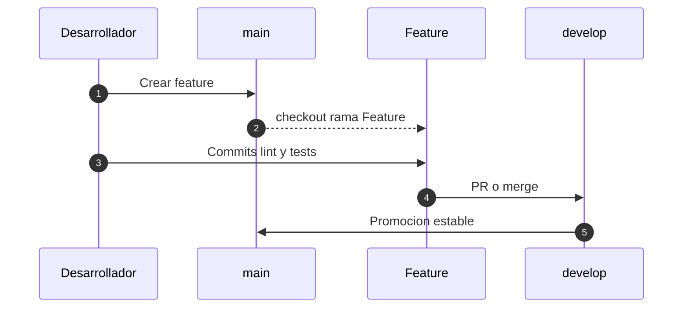

---

## CI/CD y despliegue (Vercel)

El despliegue previsto es **Vercel** (`vercel.json` define un cron diario). En el árbol actual no hay workflows de GitHub Actions documentados aquí.

1. Push / merge a la rama conectada en Vercel.  
2. Build: Prisma generate + migrate + Next build.  
3. Secretos solo en el dashboard de Vercel.  
4. Cron `0 6 * * *` → `GET /api/cron/refresh-profile-cards`.

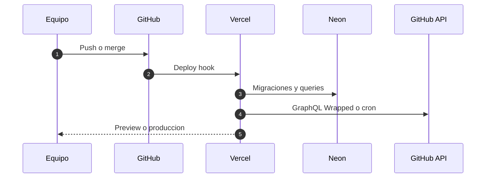

> [!WARNING]
> No hay badge de CI de Actions porque este repo no define workflows en `.github/workflows` en el estado actual. Los badges del encabezado usan shields.io sobre GitHub (último commit, versión de `package.json`, stars).

---

## Variables de entorno

Copia desde `.env.example`. Los ejemplos son orientativos; en producción usa secretos reales solo en Vercel/Neon.

| Variable | Descripción | Ejemplo | Requerida |
|----------|-------------|---------|-----------|
| `DATABASE_URL` | Postgres pooled (Neon) | `postgresql://…` | Sí |
| `DIRECT_URL` | Postgres directo (migraciones) | `postgresql://…` | Sí |
| `AUTH_SECRET` | Secreto de sesión Auth.js | salida de `npx auth secret` | Sí |
| `AUTH_GITHUB_ID` | Client ID OAuth App | `Ov23…` | Sí |
| `AUTH_GITHUB_SECRET` | Client Secret OAuth App | `…` | Sí |
| `AUTH_URL` | URL canónica para Auth.js | `http://localhost:3000` | Sí |
| `NEXT_PUBLIC_APP_URL` | URL pública (share, sitemap, robots) | `https://yearongit.com` | Recomendada en prod |
| `NEXT_PUBLIC_GA_MEASUREMENT_ID` | ID de medición GA4 | `G-XXXXXXXX` | No |
| `NEXT_PUBLIC_GSC_VERIFICATION` | Token meta Search Console | `google…` | No |
| `CRON_SECRET` | Bearer del cron de profile cards | string largo | Sí en prod con cron |

```env
DATABASE_URL=
DIRECT_URL=
AUTH_SECRET=
AUTH_GITHUB_ID=
AUTH_GITHUB_SECRET=
AUTH_URL=http://localhost:3000
# NEXT_PUBLIC_APP_URL=https://yearongit.com
# NEXT_PUBLIC_GA_MEASUREMENT_ID=G-XXXXXXXXXX
# NEXT_PUBLIC_GSC_VERIFICATION=
# CRON_SECRET=
```

> [!WARNING]
> Nunca subas `.env` / `.env.local` con secretos reales al repositorio.

---

## Estado del proyecto

Producto en evolución activa alrededor del Wrapped 2026: slides, shares, profile cards, SEO y consentimiento de cookies.

Versión en `package.json`: **0.1.0** (también en el badge dinámico del encabezado).

> [!IMPORTANT]
> El token de GitHub no sale del servidor. GraphQL agrupado antes que ráfagas REST. UI dark y narrativa.
